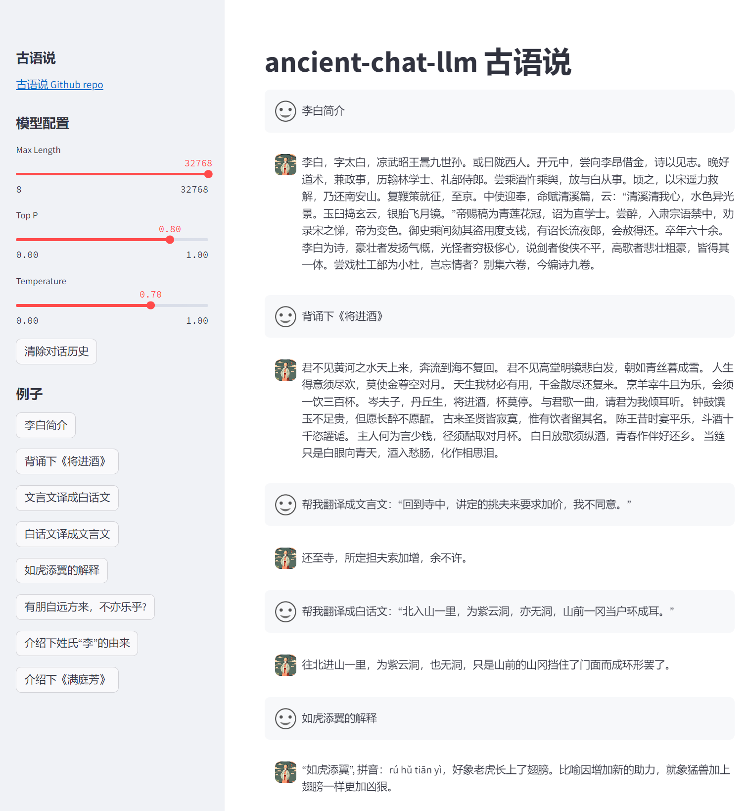

<!-- for modelscope yaml info
---
language:
- zh
tags:
- ancient-chat-llm
- internlm2
frameworks:
- pytorch
tasks:
- text-generation
license: Apache License 2.0
---
-->

# ancient-chat-llm 古语说 —— 一个精通中国文化的大模型

<!-- PROJECT SHIELDS -->
<!-- 
[![Contributors][contributors-shield]][contributors-url]
[![Forks][forks-shield]][forks-url]
[![Issues][issues-shield]][issues-url]
[![MIT License][license-shield]][license-url]
[![Stargazers][stars-shield]][stars-url]
-->

<br />
<!-- PROJECT LOGO -->

<p align="center">
  <a href="https://github.com/PeterH0323/ancient-chat-llm/">
    
  </a>

<h3 align="center">ancient-chat-llm</h3>
  <p align="center">
    <br />
    <a href="https://github.com/PeterH0323/ancient-chat-llm/tree/main/demo">查看Demo</a>
    ·
    <a href="https://github.com/PeterH0323/ancient-chat-llm/issues">报告Bug & 提出新特性</a>
  </p>
</p>

## 简介

**ancient-chat-llm 古语说** 是一个能够在用户输入现代汉语后输出文言文，同时能够解答用户 **关于中国文化的问题** 的大模型，包括但不限于**唐诗、宋词、论语**等古籍，还可以让其**将文言文翻译成白话文**等，模型用 [xtuner](https://github.com/InternLM/xtuner) 在 [InternLM2](https://github.com/InternLM/InternLM) 的基础上指令微调而来。

**开源不易，如果本项目帮到大家，可以右上角帮我点个 star~ ⭐⭐ , 您的 star ⭐是我们最大的鼓励，谢谢各位！**  

## NEWS

- [2024.1.31] 数据清洗，重训
- [2024.1.28] 新增诗词、古籍等知识微调模型
- [2024.1.16] 成语数据集微调模型

## 介绍

中国文化，博大精深，源远流长。从古老的诗词歌赋到现代的文艺创作，都展现了中华民族的智慧和创造力。

- **中国古籍**，中华文明的重要组成部分，承载着丰富的历史和文化信息，反映了古代社会的风貌和人民的智慧。这些古籍不仅具有极高的历史价值，也是我们了解古代文化、传承中华文明的重要窗口。其中，《诗经》是中国最早的诗歌总集，收录了西周初年至春秋中叶的诗歌，展现了古代人民的生活和情感。其优美的语言和深邃的思想，至今仍为人们所传颂和学习。另一部重要的古籍是 **《论语》**，其是儒家学派的经典之作，记录了孔子及其弟子的言行和思想。它强调仁爱、礼义等儒家核心价值观，对中国乃至东亚地区的文化和社会产生了深远的影响。此外，**《道德经》、《易经》** 等道家经典，以及 **《孙子兵法》、《战国策》** 等兵家著作，也都是中国古代文化古籍中的重要代表。

- **中国古诗**，蕴含着深厚的文化底蕴，闪耀着诗人的智慧与才情。以李白的 **《将进酒》** 为例，诗中“人生得意须尽欢，莫使金樽空对月”传达出豁达乐观的人生态度，激励着代代读者。这样的诗句，既是中国古诗的瑰宝，也是中华文化的骄傲。让我们共同欣赏、传承这些珍贵的文化遗产，感受中国古诗的无穷魅力。

- **中国成语**，其有固定的结构形式和固定的说法，表示一定的意义，在语句中是作为一个整体来应用的。成语有很大一部分是从古代相承沿用下来的，它代表了一个故事或者典故，有些成语本就是一个微型的句子。有些成语来自于历史事件，如“完璧归赵”、“负荆请罪”等，它们通过简短的形式，概括了整个故事的内容，使得人们可以更加方便地理解和记忆。有些成语则来自于文学作品，如“柳暗花明”、“刻舟求剑”等，这些成语通过形象的比喻，表达了深刻的道理。

**这就是我们做这个模型的初衷，我们想将中华文化教给大模型，让其能够尽可能掌握中华文化，做到文化输出。**

**ancient-chat-llm 古语说** 是一个能够在用户输入现代汉语后输出文言文，同时能够解答用户 **关于中国文化的问题** 的大模型，包括但不限于**唐诗、宋词、论语**等古籍，还可以让其**将文言文翻译成白话文**等，模型用 [xtuner](https://github.com/InternLM/xtuner) 在 [InternLM2](https://github.com/InternLM/InternLM) 的基础上指令微调而来。

**开源不易，如果本项目帮到大家，可以右上角帮我点个 star~ ⭐⭐ , 您的 star ⭐是我们最大的鼓励，谢谢各位！**  


## 演示

Demo 访问地址：https://openxlab.org.cn/apps/detail/HinGwenWong/ancient-chat-llm

<p align="center">
    
</p>

模型对比：comming soon


## 模型

| 模型 | 基座 | 数据量 | ModelScope | hugging face | OpenXLab |
| --- | --- | --- |--- | --- | --- |
| ancient-chat-llm-7b | interlm2-chat-7b | 230013 个单 conversation | [ModelScope](https://modelscope.cn/models/HinGwenWoong/ancient-chat-7b) | [hugging face](https://huggingface.co/hingwen/ancient-chat-7b) | [](https://openxlab.org.cn/models/detail/HinGwenWong/ancient-chat-llm-7b) |


<details>
<summary> 从 ModelScope 导入</summary>

```python
import torch
from modelscope import snapshot_download, AutoTokenizer, AutoModelForCausalLM
model_dir = snapshot_download('HinGwenWoong/ancient-chat-7b')
tokenizer = AutoTokenizer.from_pretrained(model_dir, device_map="auto", trust_remote_code=True)
# Set `torch_dtype=torch.float16` to load model in float16, otherwise it will be loaded as float32 and might cause OOM Error.
model = AutoModelForCausalLM.from_pretrained(model_dir, device_map="auto", trust_remote_code=True, torch_dtype=torch.float16)
model = model.eval()
response, history = model.chat(tokenizer, "你好", history=[])
print(response)
response, history = model.chat(tokenizer, "李白简介", history=history)
print(response)
```

</details>

<details>
<summary> 从 huggingface 导入 </summary>

```python
import torch
from transformers import AutoTokenizer, AutoModelForCausalLM
tokenizer = AutoTokenizer.from_pretrained("hingwen/ancient-chat-7b", trust_remote_code=True)
# Set `torch_dtype=torch.float16` to load model in float16, otherwise it will be loaded as float32 and might cause OOM Error.
model = AutoModelForCausalLM.from_pretrained("hingwen/ancient-chat-7b", device_map="auto", trust_remote_code=True, torch_dtype=torch.float16)
model = model.eval()
response, history = model.chat(tokenizer, "你好", history=[])
print(response)
response, history = model.chat(tokenizer, "李白简介", history=history)
print(response)
```

</details>

## 知识库

- [x] 文言文翻译
- [x] 成语
- [x] 论语
- [x] 唐诗
- [x] 宋词
- [x] 楚辞
- [x] 四书五经
- [x] 百家姓
- [x] 弟子规
- [ ] 史记
- [ ] 宫廷制度
- [ ] 二十四节气
- [ ] ...

## 环境搭建

本项目使用 [xtuner](https://github.com/InternLM/xtuner) 训练，在 [internlm2-chat-7b](https://huggingface.co/internlm/internlm2-chat-7b) 上进行微调

1. clone 本项目

```bash
git clone https://github.com/PeterH0323/ancient-chat-llm.git
cd ancient-chat-llm
```

2. 创建虚拟环境

```bash
conda env create -f environment.yml
conda activate ancient-chat-llm
pip install -r requirements-raw.txt
```

## 数据集准备

目前使用到的开源数据集有以下几个，我们还使用爬虫等技术进行爬取了其余知识库的数据集：

- 文言文：https://huggingface.co/datasets/RUCAIBox/Erya-dataset/tree/main
- 古诗：https://github.com/chinese-poetry/chinese-poetry

数据集结构（省略了用不到的文件）：

```bash
dataset/
├── Erya-dataset
│   ├── dataset # 解压自 finetune.tgz
│   └── stage_2 # 解压自 trans.tgz 
├── chinese-poetry
│   ├── 五代诗词
│   ├── 元曲
│   ├── 全唐诗
│   ├── 四书五经
│   ├── 宋词
│   ├── 幽梦影
│   ├── 御定全唐詩
│   ├── 曹操诗集
│   ├── 楚辞
│   ├── 水墨唐诗
│   ├── 纳兰性德
│   ├── 蒙学
│   ├── 论语
│   └── 诗经
├── gen_dataset.py
└── whoami.jsonl
```

使用脚本可以进行生成：

```bash
cd dataset
python gen_dataset.py --data-root=./dataset --output=data.jsonl
```

生成之后可以在 ${output} 设置的路径看到 jsonl 文件，样例如下：

```json
    {
        "conversation": [
            {
                "system": "你是一位专业的中文教师。你总能解答用户关于中文的相关知识。",
                "input": "帮我翻译成文言文：“往西走一里，绕着新寺西边的峰嘴往北走。”",
                "output": "西一里，转新寺西峰之嘴而北。"
            }
        ]
    },
    {
        "conversation": [
            {
                "system": "你是一位专业的中文教师。你总能解答用户关于中文的相关知识。",
                "input": "背诵《将进酒》",
                "output": "君不见黄河之水天上来，奔流到海不复回。\n君不見高堂明鏡悲白髮，朝如青絲暮成雪。\n人生得意須盡歡，莫使金樽空對月。\n天生我材必有用，千金散盡還復來。\n烹羊宰牛且爲樂，會須一飲三百盃。\n岑夫子，丹丘生，將進酒，君莫停。\n與君歌一曲，請君爲我側耳聽。\n鐘鼓饌玉不足貴，但願長醉不願醒。\n古來聖賢皆寂寞，惟有飲者留其名。\n陳王昔時宴平樂，斗酒十千恣讙謔。\n主人何爲言少錢，徑須沽取對君酌。\n五花馬，千金裘，呼兒將出換美酒，與爾同銷萬古愁。"
            }
        ]
    },
    ...
```


## 训练

1. 训练之前，需要在 `xtuner` 代码中 `xtuner/xtuner/utils/templates.py` 添加 `SYSTEM_TEMPLATE.ancient_chat` ：

```diff
SYSTEM_TEMPLATE = ConfigDict(
    moss_sft=('You are an AI assistant whose name is {bot_name}.\n'
              'Capabilities and tools that {bot_name} can possess.\n'
              '- Inner thoughts: enabled.\n'
              '- Web search: enabled. API: Search(query)\n'
              '- Calculator: enabled. API: Calculate(expression)\n'
              '- Equation solver: enabled. API: Solve(equation)\n'
              '- Text-to-image: disabled.\n'
              '- Image edition: disabled.\n'
              '- Text-to-speech: disabled.\n'),
    alpaca=('Below is an instruction that describes a task. '
            'Write a response that appropriately completes the request.\n'),
    arxiv_gentile=('If you are an expert in writing papers, please generate '
                   "a good paper title for this paper based on other authors' "
                   'descriptions of their abstracts.\n'),
    colorist=('You are a professional color designer. Please provide the '
              'corresponding colors based on the description of Human.\n'),
    coder=('You are a professional programer. Please provide the '
           'corresponding code based on the description of Human.\n'),
    lawyer='你现在是一名专业的中国律师，请根据用户的问题给出准确、有理有据的回复。\n',
    medical='如果你是一名医生，请根据患者的描述回答医学问题。\n',
    sql=('If you are an expert in SQL, please generate a good SQL Query '
         'for Question based on the CREATE TABLE statement.\n'),
+    ancient_chat="你是一位专业的中文教师。你总能解答用户关于中文的相关知识。\n",
)
```

2. 将 `./finetune_configs/internlm2_chat_7b/internlm2_chat_7b_qlora_custom_data_e3_finetune.py` 中 数据集路径 和 模型路径 改为您的本地路径

```diff
# Model
- pretrained_model_name_or_path = 'internlm/internlm2-7b'
+ pretrained_model_name_or_path = '/path/to/internlm/internlm2-7b' # 这步可选，如果事先下载好了模型可以直接使用绝对路径

# Data
- data_path = 'timdettmers/openassistant-guanaco'
+ data_path = '/path/to/data.jsonl' # 数据集步骤生成的 json 文件绝对路径
prompt_template = PROMPT_TEMPLATE.default
max_length = 2048
pack_to_max_length = True
```

3. 使用命令进行训练：

```bash
xtuner train finetune_configs/internlm2_chat_7b/internlm2_chat_7b_qlora_custom_data_e3_finetune.py --deepspeed deepspeed_zero2
```

注意：如果显存不够了，调小一点 `batch_size` 和 `max_length`，反之还剩很多，调大这两个值

## 部署

### Web 部署 Demo

1. 将 pth 转为 hf 

```bash
xtuner convert pth_to_hf ./finetune_configs/internlm_chat_7b/internlm2_chat_7b_qlora_custom_data_e3_finetune.py \
                         ./work_dirs/internlm2_chat_7b_qlora_custom_data_e3_finetune/epoch_3.pth \
                         ./work_dirs/internlm2_chat_7b_qlora_custom_data_e3_finetune/epoch_3_hf
```

2. 将微调后的模型和源模型 merge 生成新的模型

```bash
export MKL_SERVICE_FORCE_INTEL=1 # 解决 Error: mkl-service + Intel(R) MKL: MKL_THREADING_LAYER=INTEL is incompatible with libgomp.so.1 library.
xtuner convert merge /path/to/internlm2-chat-7b \
                     ./work_dirs/internlm2_chat_7b_qlora_custom_data_e3_finetune/epoch_3_hf \
                     ./work_dirs/internlm2_chat_7b_qlora_custom_data_e3_finetune/epoch_3_merge
```

3. 启动 web demo

```bash
streamlit run web_demo.py --server.address=0.0.0.0 --server.port 7860
```

<!-- # 也可以直接使用命令行 cli 的方式进行启动
xtuner chat ./work_dirs/internlm2_chat_7b_qlora_custom_data_e3_finetune/epoch_3_merge \
            --prompt-template internlm2_chat \
            --system-template ancient_chat -->

### LMDeploy 

1. 安装 lmdeploy

```bash
pip install 'lmdeploy[all]==v0.2.1'
```

2. 进行 KV int8 量化

```bash
lmdeploy lite calibrate ./work_dirs/internlm2_chat_7b_qlora_custom_data_e3_finetune/epoch_3_merge \
                        --calib-dataset "c4" \
                        --calib-samples 128 \
                        --calib-seqlen 2048 \
                        --work-dir ./work_dirs/internlm2_chat_7b_qlora_custom_data_e3_finetune/quant_ancient-chat-7b_output

```

## TODO

- [ ] 模型仍需迭代
- [ ] 数据集需要清洗
- [ ] 使用其它大模型进行数据集扩充
- [ ] 量化模型

## 后记

本项目属于个人的一个学习项目，还有很多不足的地方，例如本模型在数据集方面的还没做很精细的调优，还有时候标点符号会错误。

欢迎大家一起讨论，如果大家有数据集，可以在 issue 留言讨论。
